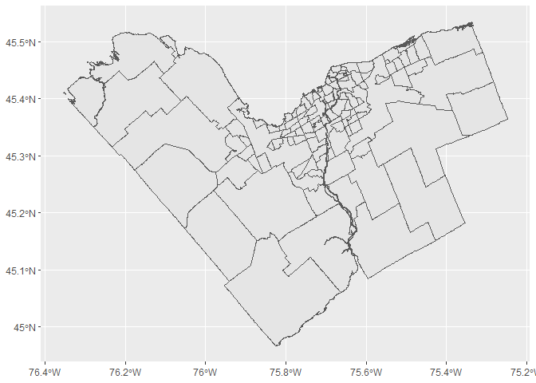
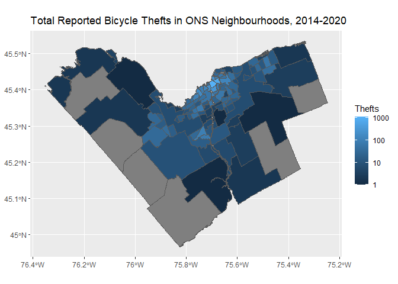

<!-- README.md is generated from README.Rmd. Please edit that file -->

# onsr

<!-- badges: start -->

<!-- badges: end -->

This package collects common R functions used in the Ottawa
Neighbourhood Study’s (ONS) data-science work. We use it to speed up our
work, but anyone is welcome to use it or learn from it.

## Installation

You can install the development version from
[GitHub](https://github.com/) with:

``` r
# install.packages("devtools")
devtools::install_github("Ottawa-Neighbourhood-Study/onsr")
```

## Example

This is a basic example which shows you how to solve a common problem:

``` r
# Load the ONS Gen 2 shapefile and plot it.
library(onsr)
library(tidyverse)
#> -- Attaching packages --------------------------------------- tidyverse 1.3.0 --
#> v ggplot2 3.3.2     v purrr   0.3.4
#> v tibble  3.0.4     v dplyr   1.0.2
#> v tidyr   1.1.2     v stringr 1.4.0
#> v readr   1.4.0     v forcats 0.5.0
#> -- Conflicts ------------------------------------------ tidyverse_conflicts() --
#> x dplyr::filter() masks stats::filter()
#> x dplyr::lag()    masks stats::lag()

ons_shp <- get_ons_shp()

ons_shp %>%
  ggplot() +
    geom_sf()
```



And we can also easily locate point data within the ONS neighbourhoods:

``` r
library(sf)
library(leaflet)

bike_thefts <- sf::read_sf("https://opendata.arcgis.com/datasets/3620cc7a3b874557bb288d889a4d56c2_0.geojson")

bike_thefts_pts <- get_pts_neighbourhood(pts = bike_thefts,
                                          pgon = ons_shp)


bike_thefts_nbhd <- bike_thefts_pts %>%
  group_by(ONS_ID, Name, Name_FR) %>%
  summarise(total_thefts= n()) %>%
  sf::st_set_geometry(NULL) %>%
  right_join(ons_shp) %>%
  mutate(total_thefts = if_else(is.na(total_thefts), 0L, total_thefts)) %>%
  sf::st_as_sf()

bike_thefts_nbhd %>%
  ggplot() +
  geom_sf(aes(fill = total_thefts)) +
  scale_fill_gradient(trans="log",
                      breaks = c(1,10,100, 1000)) +
  labs(fill = "Thefts",
       title = "Total Reported Bicycle Thefts in ONS Neighbourhoods, 2014-2020")
```


